## Setup


```python
# DO NOT ALTER THIS CELL OR ITS TAG (parameters). It is used by papermill to fill in these parameters before executing the notebook.
DATA_PATH = "/home/it1123/dev_local/cse284/snp_clustering/tmp/clustering_pca.eigenvec"
K_HIGH = 14
RAND_SEED = 256
CLUSTERING_ITERS = 500
```


```python
# Parameters
DATA_PATH = "/home/it1123/dev_local/cse284/snp_clustering/tmp/clustering_pca.eigenvec"
K_HIGH = 14
RAND_SEED = 256
CLUSTERING_ITERS = 500

```


```python
import os
import numpy as np
import pandas as pd
from sklearn.cluster import KMeans
from sklearn.metrics import silhouette_score, pairwise_distances
from sklearn.cluster import AgglomerativeClustering
from scipy.cluster.hierarchy import linkage, dendrogram
import matplotlib.pyplot as plt

```


```python
# set directories
REPO_DIR = os.path.dirname(os.getcwd())
DATA_DIR = os.path.join(REPO_DIR, "data")
OUT_DIR = os.path.join(REPO_DIR, "out")
POPCODES_PATH = os.path.join(DATA_DIR, "igsr_samples.tsv")
RAND_SEED = 256
MARKERS = [
    "o", "v", "1", "2", "3", "4", "8", "s", "p", "*", "h", "H", "+", "x", "D", "d", "|", "_", 
    0, 1, 2, 3, 4, 5, 6, 7, 8, 9, 10, 11
]
COLORS = [
    'red', 'blue', 'green', 'cyan', 'magenta', 'yellow', 'black', 'white',
    'gray', 'orange', 'pink', 'brown', 'purple', 'lime', 'olive', 'navy',
    'maroon', 'teal', 'aqua', 'silver', 'gold', 'indigo', 'violet', 'crimson',
    'coral', 'turquoise', 'salmon', 'khaki', 'plum', 'orchid', 'beige', 'mint',
    'lavender'
]
```


```python
len(MARKERS)
```


    30


## Data Loading/Preprocessing
We assume the existence of the file containing the coordinates of each sample in the eigenbasis (computed by `plink`)

### Load data & label columns


```python
pca_data = pd.read_csv(DATA_PATH, delim_whitespace=True, header=None)
popcodes_df = pd.read_csv(POPCODES_PATH, sep="\t", header=0)
id_cols = ["family_id", "id"]
pop_cols = ["pop", "subpop"]
pc_cols = [f"pc{i+1}" for i in range(pca_data.shape[1] - 2)]
pca_data.columns =  id_cols + pc_cols
```


```python
pca_data.head()
```


<div>
<style scoped>
    .dataframe tbody tr th:only-of-type {
        vertical-align: middle;
    }

    .dataframe tbody tr th {
        vertical-align: top;
    }

    .dataframe thead th {
        text-align: right;
    }
</style>
<table border="1" class="dataframe">
  <thead>
    <tr style="text-align: right;">
      <th></th>
      <th>family_id</th>
      <th>id</th>
      <th>pc1</th>
      <th>pc2</th>
      <th>pc3</th>
      <th>pc4</th>
    </tr>
  </thead>
  <tbody>
    <tr>
      <th>0</th>
      <td>HG00096</td>
      <td>HG00096</td>
      <td>-0.009763</td>
      <td>0.027213</td>
      <td>0.013751</td>
      <td>0.015727</td>
    </tr>
    <tr>
      <th>1</th>
      <td>HG00097</td>
      <td>HG00097</td>
      <td>-0.014707</td>
      <td>0.026629</td>
      <td>0.011751</td>
      <td>0.011084</td>
    </tr>
    <tr>
      <th>2</th>
      <td>HG00099</td>
      <td>HG00099</td>
      <td>-0.012137</td>
      <td>0.025007</td>
      <td>0.008817</td>
      <td>0.014421</td>
    </tr>
    <tr>
      <th>3</th>
      <td>HG00100</td>
      <td>HG00100</td>
      <td>-0.012606</td>
      <td>0.027683</td>
      <td>0.014390</td>
      <td>0.008601</td>
    </tr>
    <tr>
      <th>4</th>
      <td>HG00101</td>
      <td>HG00101</td>
      <td>-0.012874</td>
      <td>0.022498</td>
      <td>0.017722</td>
      <td>0.007210</td>
    </tr>
  </tbody>
</table>
</div>


```python
print (popcodes_df["Superpopulation code"].unique())
print()
print (popcodes_df['Population code'].unique())
```

    ['EUR' 'EAS' 'AMR' 'SAS' 'AFR' nan 'EUR,AFR']
    
    ['FIN' 'GBR' 'CHS' 'PUR' 'CDX' 'CLM' 'IBS' 'KHV' 'PEL' 'PJL' 'ACB' 'GWD'
     'ESN' 'BEB' 'MSL' 'ITU' 'STU' 'CEU' 'YRI' 'CHB' 'JPT' 'LWK' 'MXL' 'ASW'
     'TSI' 'GIH' 'GWJ' 'GWF' 'GWW' nan 'MKK' 'IBS,MSL']


### Map samples to population/subpopulation codes & get feature matrix $X$


```python
#map samples to populations/subpopulation code
pca_data["pop"] = pca_data["id"].apply(lambda x: popcodes_df.loc[popcodes_df['Sample name'] == x, 'Superpopulation code'].squeeze())
pca_data["subpop"] = pca_data["id"].apply(lambda x: popcodes_df.loc[popcodes_df['Sample name'] == x, 'Population code'].squeeze())

pca_data = pca_data.loc[:, id_cols + pop_cols + pc_cols]
#get feature matrix for clustering
pop_data = pca_data.loc[:, id_cols + pop_cols]
X = pca_data.loc[:, pc_cols].to_numpy()

```


```python
pop_data.head()
```


<div>
<style scoped>
    .dataframe tbody tr th:only-of-type {
        vertical-align: middle;
    }

    .dataframe tbody tr th {
        vertical-align: top;
    }

    .dataframe thead th {
        text-align: right;
    }
</style>
<table border="1" class="dataframe">
  <thead>
    <tr style="text-align: right;">
      <th></th>
      <th>family_id</th>
      <th>id</th>
      <th>pop</th>
      <th>subpop</th>
    </tr>
  </thead>
  <tbody>
    <tr>
      <th>0</th>
      <td>HG00096</td>
      <td>HG00096</td>
      <td>EUR</td>
      <td>GBR</td>
    </tr>
    <tr>
      <th>1</th>
      <td>HG00097</td>
      <td>HG00097</td>
      <td>EUR</td>
      <td>GBR</td>
    </tr>
    <tr>
      <th>2</th>
      <td>HG00099</td>
      <td>HG00099</td>
      <td>EUR</td>
      <td>GBR</td>
    </tr>
    <tr>
      <th>3</th>
      <td>HG00100</td>
      <td>HG00100</td>
      <td>EUR</td>
      <td>GBR</td>
    </tr>
    <tr>
      <th>4</th>
      <td>HG00101</td>
      <td>HG00101</td>
      <td>EUR</td>
      <td>GBR</td>
    </tr>
  </tbody>
</table>
</div>


```python
X[:5]
```


    array([[-0.0097632 ,  0.0272129 ,  0.013751  ,  0.0157271 ],
           [-0.0147066 ,  0.0266289 ,  0.0117507 ,  0.0110837 ],
           [-0.0121369 ,  0.0250071 ,  0.00881677,  0.0144206 ],
           [-0.0126055 ,  0.0276831 ,  0.0143899 ,  0.00860087],
           [-0.0128736 ,  0.0224982 ,  0.0177218 ,  0.00721044]])


### create mapping between true population and point shape in clustering


```python
pops_unique = pca_data['pop'].unique()
pop_shapes = dict(zip(pops_unique, MARKERS[:pops_unique.shape[0]]))
```


```python
subpops_unique = pca_data['subpop'].unique()
subpop_shapes = dict(zip(subpops_unique, MARKERS[:subpops_unique.shape[0]]))
subpop_shapes
```


    {'GBR': 'o',
     'FIN': 'v',
     'CHS': '1',
     'PUR': '2',
     'CDX': '3',
     'CLM': '4',
     'IBS': '8',
     'PEL': 's',
     'PJL': 'p',
     'KHV': '*',
     'IBS,MSL': 'h',
     'ACB': 'H',
     'GWD': '+',
     'ESN': 'x',
     'BEB': 'D',
     'MSL': 'd',
     'STU': '|',
     'ITU': '_',
     'CEU': 0,
     'YRI': 1,
     'CHB': 2,
     'JPT': 3,
     'LWK': 4,
     'ASW': 5,
     'MXL': 6,
     'TSI': 7,
     'GIH': 8}


## Data Exploration

### Contributions of SNPs to Principal Components


```python
VAR_DATA_PATH = f"{DATA_PATH}.var"

var_data = pd.read_csv(VAR_DATA_PATH, delim_whitespace=True, header=None)
cols = ["chrom", "rsid", "allele1", "allele2"]  + [f"PC{i-3}_contribution" for i in range(4, var_data.shape[1])]
var_data.columns = cols
var_data['PC1_contribution_abs'] = np.abs(var_data['PC1_contribution'])
var_data = var_data.sort_values(by='PC1_contribution_abs', ascending=False)
```


```python
var_data_best = var_data.iloc[:5000, :]
var_data_best['PC1_contribution_abs'].min()
#plt.barh(var_data_best['rsid'], var_data_best['PC1_contribution_abs'])
```


    1.01957


### pairwise distance analysis

#### All Data


```python
plt.title("Pairwise Distances between PCA Data Samples")
plt.xlabel("pairwise distance (L2 Norm)")
plt.xticks(np.arange(0, 0.5, 0.025))
plt.ylabel("frequency")
plt.hist(pairwise_distances(X).flatten(),bins=100)
```


    (array([4.63400e+03, 2.50960e+04, 7.31660e+04, 1.20174e+05, 1.44098e+05,
            1.51302e+05, 1.42808e+05, 1.26522e+05, 1.08050e+05, 8.95140e+04,
            7.23540e+04, 5.77800e+04, 4.61280e+04, 3.75620e+04, 3.07620e+04,
            2.67980e+04, 2.37560e+04, 2.13940e+04, 1.93660e+04, 1.80440e+04,
            1.81460e+04, 1.86120e+04, 1.96460e+04, 2.09820e+04, 2.27300e+04,
            2.51080e+04, 2.79680e+04, 3.06640e+04, 3.42900e+04, 3.91840e+04,
            4.48160e+04, 5.36820e+04, 6.76700e+04, 8.66440e+04, 1.13314e+05,
            1.51680e+05, 2.01218e+05, 2.65920e+05, 3.39364e+05, 4.17180e+05,
            4.69148e+05, 4.69668e+05, 4.04446e+05, 3.13708e+05, 2.28830e+05,
            1.66430e+05, 1.23684e+05, 9.40740e+04, 7.28640e+04, 5.73720e+04,
            4.49600e+04, 3.53080e+04, 2.86320e+04, 2.33260e+04, 1.98060e+04,
            1.74820e+04, 1.56880e+04, 1.43140e+04, 1.32300e+04, 1.26300e+04,
            1.26820e+04, 1.22760e+04, 1.22460e+04, 1.23940e+04, 1.17360e+04,
            1.08840e+04, 1.02800e+04, 9.93600e+03, 9.76600e+03, 9.84600e+03,
            9.84600e+03, 1.06240e+04, 1.10360e+04, 1.23060e+04, 1.34080e+04,
            1.42520e+04, 1.48080e+04, 1.39960e+04, 1.36920e+04, 1.26940e+04,
            1.16800e+04, 1.06480e+04, 9.31400e+03, 7.83400e+03, 6.59200e+03,
            5.56600e+03, 4.46600e+03, 3.31000e+03, 2.62800e+03, 1.85600e+03,
            1.25200e+03, 9.00000e+02, 6.24000e+02, 3.82000e+02, 2.28000e+02,
            1.62000e+02, 6.80000e+01, 3.60000e+01, 2.00000e+01, 1.60000e+01]),
     array([0.        , 0.0014538 , 0.0029076 , 0.0043614 , 0.0058152 ,
            0.007269  , 0.0087228 , 0.0101766 , 0.0116304 , 0.0130842 ,
            0.014538  , 0.0159918 , 0.0174456 , 0.0188994 , 0.0203532 ,
            0.021807  , 0.02326079, 0.02471459, 0.02616839, 0.02762219,
            0.02907599, 0.03052979, 0.03198359, 0.03343739, 0.03489119,
            0.03634499, 0.03779879, 0.03925259, 0.04070639, 0.04216019,
            0.04361399, 0.04506779, 0.04652159, 0.04797539, 0.04942919,
            0.05088299, 0.05233679, 0.05379059, 0.05524439, 0.05669819,
            0.05815199, 0.05960579, 0.06105959, 0.06251339, 0.06396719,
            0.06542099, 0.06687478, 0.06832858, 0.06978238, 0.07123618,
            0.07268998, 0.07414378, 0.07559758, 0.07705138, 0.07850518,
            0.07995898, 0.08141278, 0.08286658, 0.08432038, 0.08577418,
            0.08722798, 0.08868178, 0.09013558, 0.09158938, 0.09304318,
            0.09449698, 0.09595078, 0.09740458, 0.09885838, 0.10031218,
            0.10176598, 0.10321978, 0.10467358, 0.10612738, 0.10758118,
            0.10903498, 0.11048877, 0.11194257, 0.11339637, 0.11485017,
            0.11630397, 0.11775777, 0.11921157, 0.12066537, 0.12211917,
            0.12357297, 0.12502677, 0.12648057, 0.12793437, 0.12938817,
            0.13084197, 0.13229577, 0.13374957, 0.13520337, 0.13665717,
            0.13811097, 0.13956477, 0.14101857, 0.14247237, 0.14392617,
            0.14537997]),
     <BarContainer object of 100 artists>)


    
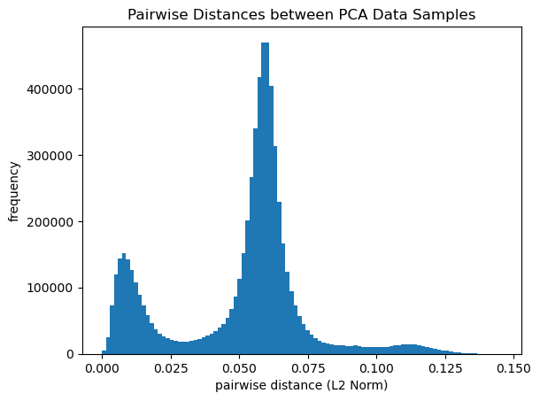
    


#### Intra-Population


```python
pop_code = "EUR"
X_pop = pca_data.loc[pca_data['pop'] == pop_code, pc_cols]
plt.title(f"Pairwise Distances between PCA Data Samples ({pop_code})")
plt.xlabel("pairwise distance (L2 Norm)")
plt.ylabel("frequency")
plt.xticks(np.arange(0, 0.5, 0.01))
plt.hist(pairwise_distances(X_pop).flatten(), bins=100)
```


    (array([5.040e+02, 1.600e+01, 1.100e+02, 2.520e+02, 5.080e+02, 8.540e+02,
            1.306e+03, 1.842e+03, 2.410e+03, 3.022e+03, 3.648e+03, 4.296e+03,
            4.906e+03, 5.430e+03, 5.952e+03, 6.404e+03, 6.798e+03, 7.138e+03,
            7.298e+03, 7.780e+03, 7.748e+03, 7.996e+03, 8.044e+03, 8.160e+03,
            8.068e+03, 8.070e+03, 7.906e+03, 7.956e+03, 7.486e+03, 7.446e+03,
            7.254e+03, 6.862e+03, 6.760e+03, 6.442e+03, 6.002e+03, 5.816e+03,
            5.494e+03, 5.138e+03, 4.742e+03, 4.452e+03, 4.112e+03, 3.894e+03,
            3.534e+03, 3.312e+03, 3.106e+03, 2.710e+03, 2.522e+03, 2.172e+03,
            2.150e+03, 1.828e+03, 1.712e+03, 1.578e+03, 1.386e+03, 1.256e+03,
            1.112e+03, 9.840e+02, 8.740e+02, 7.480e+02, 6.560e+02, 5.800e+02,
            5.380e+02, 4.100e+02, 4.020e+02, 3.020e+02, 2.520e+02, 2.300e+02,
            2.080e+02, 1.940e+02, 1.440e+02, 1.380e+02, 1.080e+02, 7.800e+01,
            9.000e+01, 5.000e+01, 5.400e+01, 6.000e+01, 4.200e+01, 3.000e+01,
            3.600e+01, 1.800e+01, 1.800e+01, 2.000e+01, 8.000e+00, 2.000e+00,
            6.000e+00, 6.000e+00, 0.000e+00, 2.000e+00, 6.000e+00, 2.000e+00,
            2.000e+00, 4.000e+00, 0.000e+00, 0.000e+00, 0.000e+00, 0.000e+00,
            0.000e+00, 0.000e+00, 0.000e+00, 2.000e+00]),
     array([0.        , 0.00038978, 0.00077957, 0.00116935, 0.00155913,
            0.00194892, 0.0023387 , 0.00272848, 0.00311826, 0.00350805,
            0.00389783, 0.00428761, 0.0046774 , 0.00506718, 0.00545696,
            0.00584675, 0.00623653, 0.00662631, 0.0070161 , 0.00740588,
            0.00779566, 0.00818544, 0.00857523, 0.00896501, 0.00935479,
            0.00974458, 0.01013436, 0.01052414, 0.01091393, 0.01130371,
            0.01169349, 0.01208327, 0.01247306, 0.01286284, 0.01325262,
            0.01364241, 0.01403219, 0.01442197, 0.01481176, 0.01520154,
            0.01559132, 0.01598111, 0.01637089, 0.01676067, 0.01715045,
            0.01754024, 0.01793002, 0.0183198 , 0.01870959, 0.01909937,
            0.01948915, 0.01987894, 0.02026872, 0.0206585 , 0.02104829,
            0.02143807, 0.02182785, 0.02221763, 0.02260742, 0.0229972 ,
            0.02338698, 0.02377677, 0.02416655, 0.02455633, 0.02494612,
            0.0253359 , 0.02572568, 0.02611547, 0.02650525, 0.02689503,
            0.02728481, 0.0276746 , 0.02806438, 0.02845416, 0.02884395,
            0.02923373, 0.02962351, 0.0300133 , 0.03040308, 0.03079286,
            0.03118265, 0.03157243, 0.03196221, 0.03235199, 0.03274178,
            0.03313156, 0.03352134, 0.03391113, 0.03430091, 0.03469069,
            0.03508048, 0.03547026, 0.03586004, 0.03624982, 0.03663961,
            0.03702939, 0.03741917, 0.03780896, 0.03819874, 0.03858852,
            0.03897831]),
     <BarContainer object of 100 artists>)


    
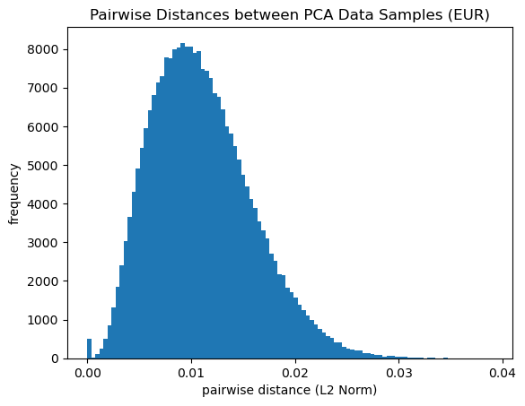
    


## Clustering
#### Here we cluster the principal component data using $k$-means clustering and hierarchical clustering (Ward's method, agglomerative).

### $k$-Means Clustering

#### Find optimal $k$


```python
# fit K-means, tune k
#silhouette scores as a measure of clustering quality
#sil scores are from -1 to 1
sil_scores = []
K = range(2, K_HIGH)
for k in K:
    kmeans = KMeans(n_clusters=k, init='k-means++', n_init=10, max_iter=CLUSTERING_ITERS, random_state=RAND_SEED)
    kmeans.fit(X)
    labels = kmeans.labels_
    sil_scores.append(silhouette_score(X, labels))

sil_scores = np.array(sil_scores)
optimal_k = K[np.argmax(sil_scores)]
kmeans_optimal = KMeans(n_clusters=optimal_k, init='k-means++', n_init=10, max_iter=CLUSTERING_ITERS, random_state=RAND_SEED)
kmeans_optimal.fit(X)
print (f"optimal k: {optimal_k}; best silhouette score: {np.max(sil_scores)}")
```

    optimal k: 6; best silhouette score: 0.7436697193910644


#### Plot silhouette score vs $k$


```python
# plot clustering quality vs k
plt.figure(figsize=(6, 4))
plt.plot(K, sil_scores, marker='x')
plt.xlabel('k')
plt.ylabel('silhouette score')
plt.title('silhouette score vs. k')
plt.show()
```


    
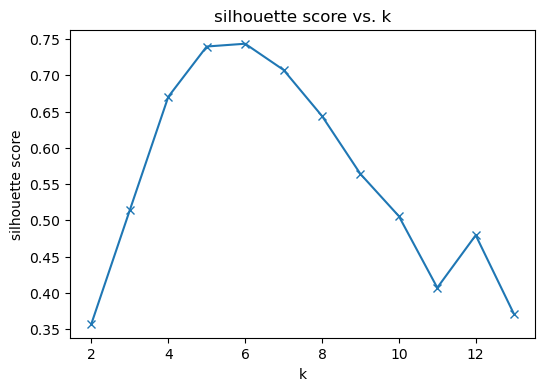
    


#### Plot optimal clustering


```python
pca_data['inferred_assignment'] = kmeans_optimal.labels_
plt.figure(figsize=(11, 11))
plt.title(f'Optimal Clustering (Populations, $k$ = {optimal_k})')
plt.xlabel("PC1")
plt.ylabel("PC2")
for true_pop in pops_unique:
    for inferred_assignment in range(kmeans_optimal.labels_.max() + 1):
        # Select points that have true population = true_pop and inferred pop = inferred assignment
        mask = (pca_data['pop'] == true_pop) & (pca_data['inferred_assignment'] == inferred_assignment)

        #X has the same ordering as pca_data
        #we are naively selecting the first two coordinates because the first two PCs likely will dominate the coordinate variance
        selected_points = X[mask, :]
        
        # Plot selected points with the corresponding marker and color
        plt.scatter(selected_points[:, 0], selected_points[:, 1], s=12, marker=pop_shapes[true_pop], color=COLORS[inferred_assignment], label=f"True: {true_pop}, Inferred: {pops_unique[inferred_assignment]}")
plt.legend(bbox_to_anchor=(1.06, 1), loc='upper left', ncol=2)

```


    <matplotlib.legend.Legend at 0x7f34f9a3e0d0>


    
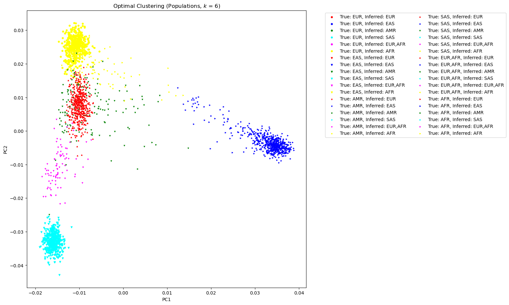
    


### Does optimal $k$-means clustering capture subpopulation structure?


```python
sil_scores_subpop = []
K = range(20, 30)
for k in K:
    kmeans = KMeans(n_clusters=k, init='k-means++', n_init=10, max_iter=CLUSTERING_ITERS, random_state=RAND_SEED)
    kmeans.fit(X)
    labels = kmeans.labels_
    sil_scores_subpop.append(silhouette_score(X, labels))

sil_scores_subpop = np.array(sil_scores_subpop)
optimal_k_subpop = K[np.argmax(sil_scores_subpop)]
kmeans_optimal_subpop = KMeans(n_clusters=optimal_k_subpop, init='k-means++', n_init=10, max_iter=300, random_state=RAND_SEED)
kmeans_optimal_subpop.fit(X)
print (f"optimal k: {optimal_k_subpop}; best silhouette score: {np.max(sil_scores_subpop)}")
```

    optimal k: 20; best silhouette score: 0.26561105230969506


```python
# plot clustering quality vs k
plt.figure(figsize=(6, 4))
plt.plot(K, sil_scores_subpop, marker='x')
plt.xlabel('k')
plt.ylabel('silhouette score')
plt.title('silhouette score vs. $k$')
plt.show()
```


    
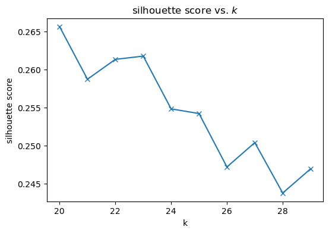
    


```python

pca_data['inferred_assignment'] = kmeans_optimal_subpop.labels_
plt.figure(figsize=(12, 10))
plt.title(f'Optimal Clustering (Subpopulations, $k$ = {optimal_k_subpop})')
plt.xlabel("PC1")
plt.ylabel("PC2")
for true_subpop in subpops_unique:
    for inferred_assignment in range(kmeans_optimal_subpop.labels_.max() + 1):
        # Select points that have true population = true_pop and inferred pop = inferred assignment
        mask = (pca_data['subpop'] == true_subpop) & (pca_data['inferred_assignment'] == inferred_assignment)

        #X has the same ordering as pca_data
        #we are naively selecting the first two coordinates because the first two PCs likely will dominate the variation
        selected_points = X[mask, :]
        if selected_points.shape[0] == 0: continue
        # plot selected pts with the corresponding marker and color
        plt.scatter(selected_points[:, 0], selected_points[:, 1], s=4, marker=subpop_shapes[true_subpop], color=COLORS[inferred_assignment], label=f"True: {true_subpop}, Inferred: {subpops_unique[inferred_assignment]}")
plt.legend(bbox_to_anchor=(1.05, 1), loc='upper left', ncol=3)
```


    <matplotlib.legend.Legend at 0x7f34ee303340>


    
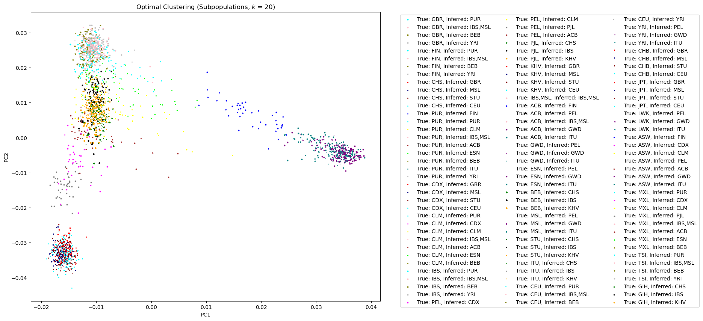
    


##### Analysis


```python
#what's the number of true subpopulations in our data?
num_pops = pca_data['pop'].unique().shape[0]
num_subpops = pca_data['subpop'].unique().shape[0]
num_pops, num_subpops
```


    (6, 27)


### Hierarchical Clustering


```python
def plt_dendrogram(hier_instance, distance_threshold, Z, method_name, p=6, truncate_mode='level', show_contracted=True, fs=5):
    plt.figure(figsize=(10, 7))
    dendrogram(Z, p=p, truncate_mode=truncate_mode, show_contracted=show_contracted)
    plt.title(f'Cluster Hierarchy ({method_name} linkage); $k$={hier_instance.n_clusters_}, d_thres={distance_threshold}')
    plt.xlabel('Sample index')
    plt.ylabel('Distance')
    plt.xticks(fontsize=fs, rotation=90)
    plt.legend()
    plt.show()

def tune_hier(linkage='ward', dt_low=0, dt_high=1, inc=0.02):
    sil_scores_tune = []
    for dt in np.arange(0, 1 + inc, inc):
        hier_tune = AgglomerativeClustering(linkage=linkage, n_clusters=None, distance_threshold=dt, compute_full_tree=True)
        hier_tune.fit(X)
        if np.unique(hier_tune.labels_).shape[0] < 2 or np.unique(hier_tune.labels_).shape[0] >= X.shape[0]:
            print ("cannot compute silhouette score, determined number of clusters is too small/big. Consider increasing distance threshold")
            sil_scores_tune.append(-1)
        else:
            sil_score_hier_tune = silhouette_score(X, hier_tune.labels_)
            sil_scores_tune.append(sil_score_hier_tune)
    sil_scores_tune = np.array(sil_scores_tune)
    optimal_dt = np.argmax(sil_scores_tune) * inc
    hier_best = AgglomerativeClustering(linkage=linkage, n_clusters=None, distance_threshold=optimal_dt, compute_full_tree=True)
    hier_best.fit(X)
    print ("done")
    print (f"optimal k: {hier_best.n_clusters_}; optimal distance threshold: {optimal_dt}; silhouette score: {silhouette_score(X, hier_best.labels_)}")
    return hier_best, sil_scores_tune, optimal_dt

def plt_sil_scores(method_name, sil_scores, inc=0.01, s=2):
    inc = 0.01
    xt = np.arange(0, 1 + inc, inc)
    plt.figure(figsize=(10,7))
    plt.title(f"Silhouette Score vs. Distance Threshold ({method_name} linkage)")
    plt.xlabel("distance threshold")
    plt.ylabel("Silhouette Score")
    plt.xlim([0, 1])
    plt.scatter(xt, sil_scores, s=s)
```

#### Using Ward Linkage


```python
hier_ward, sil_scores_ward, optimal_dt_ward = tune_hier(linkage='ward', dt_low=0, dt_high=1, inc=0.01)
```

    cannot compute silhouette score, determined number of clusters is too small/big. Consider increasing distance threshold


    done
    optimal k: 6; optimal distance threshold: 0.29; silhouette score: 0.7337131321988386


```python
plt_sil_scores('ward', sil_scores_ward, inc=0.01, s=2)
```


    
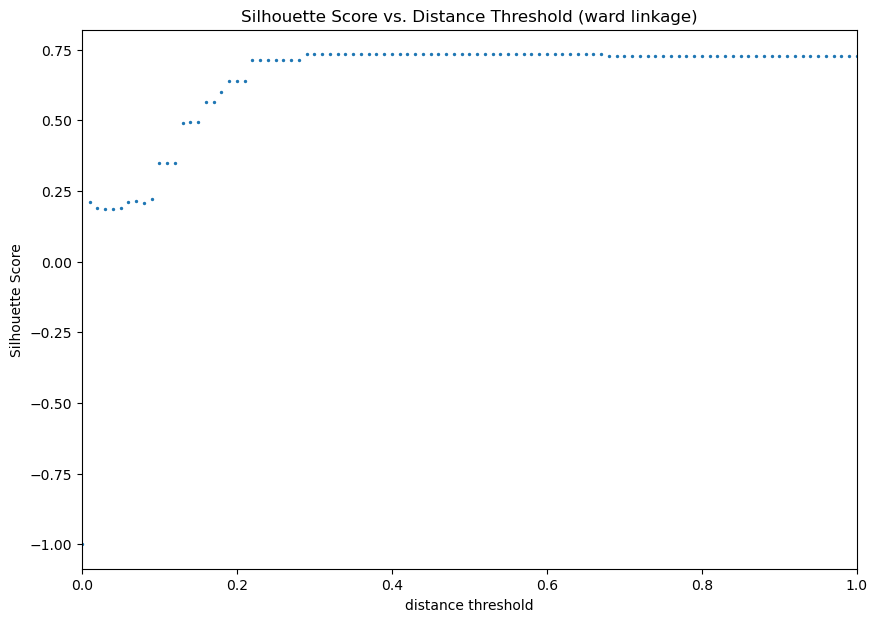
    


```python
Z_ward = linkage(X, 'ward')
```


```python
plt_dendrogram(hier_ward, optimal_dt_ward, Z_ward, 'ward', p=6, truncate_mode='level', show_contracted=True, fs=4)
```

    No artists with labels found to put in legend.  Note that artists whose label start with an underscore are ignored when legend() is called with no argument.


    
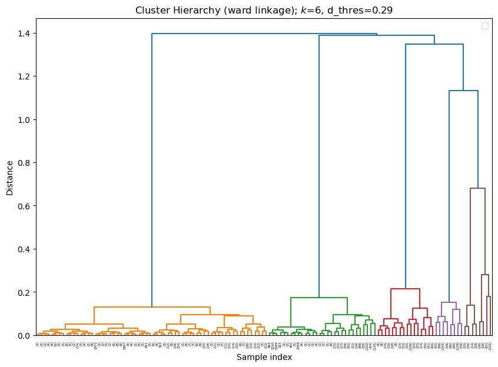
    


```python
hier_ward.n_clusters_
```


    6


#### Using Average Linkage


```python
hier_avg, sil_scores_avg, optimal_dt_avg = tune_hier(linkage='average', dt_low=0, dt_high=1, inc=0.01)
```

    cannot compute silhouette score, determined number of clusters is too small/big. Consider increasing distance threshold


    cannot compute silhouette score, determined number of clusters is too small/big. Consider increasing distance threshold
    cannot compute silhouette score, determined number of clusters is too small/big. Consider increasing distance threshold
    cannot compute silhouette score, determined number of clusters is too small/big. Consider increasing distance threshold
    cannot compute silhouette score, determined number of clusters is too small/big. Consider increasing distance threshold
    cannot compute silhouette score, determined number of clusters is too small/big. Consider increasing distance threshold


    cannot compute silhouette score, determined number of clusters is too small/big. Consider increasing distance threshold
    cannot compute silhouette score, determined number of clusters is too small/big. Consider increasing distance threshold
    cannot compute silhouette score, determined number of clusters is too small/big. Consider increasing distance threshold
    cannot compute silhouette score, determined number of clusters is too small/big. Consider increasing distance threshold
    cannot compute silhouette score, determined number of clusters is too small/big. Consider increasing distance threshold


    cannot compute silhouette score, determined number of clusters is too small/big. Consider increasing distance threshold
    cannot compute silhouette score, determined number of clusters is too small/big. Consider increasing distance threshold
    cannot compute silhouette score, determined number of clusters is too small/big. Consider increasing distance threshold
    cannot compute silhouette score, determined number of clusters is too small/big. Consider increasing distance threshold
    cannot compute silhouette score, determined number of clusters is too small/big. Consider increasing distance threshold


    cannot compute silhouette score, determined number of clusters is too small/big. Consider increasing distance threshold
    cannot compute silhouette score, determined number of clusters is too small/big. Consider increasing distance threshold
    cannot compute silhouette score, determined number of clusters is too small/big. Consider increasing distance threshold
    cannot compute silhouette score, determined number of clusters is too small/big. Consider increasing distance threshold
    cannot compute silhouette score, determined number of clusters is too small/big. Consider increasing distance threshold


    cannot compute silhouette score, determined number of clusters is too small/big. Consider increasing distance threshold
    cannot compute silhouette score, determined number of clusters is too small/big. Consider increasing distance threshold
    cannot compute silhouette score, determined number of clusters is too small/big. Consider increasing distance threshold
    cannot compute silhouette score, determined number of clusters is too small/big. Consider increasing distance threshold
    cannot compute silhouette score, determined number of clusters is too small/big. Consider increasing distance threshold


    cannot compute silhouette score, determined number of clusters is too small/big. Consider increasing distance threshold
    cannot compute silhouette score, determined number of clusters is too small/big. Consider increasing distance threshold
    cannot compute silhouette score, determined number of clusters is too small/big. Consider increasing distance threshold
    cannot compute silhouette score, determined number of clusters is too small/big. Consider increasing distance threshold
    cannot compute silhouette score, determined number of clusters is too small/big. Consider increasing distance threshold


    cannot compute silhouette score, determined number of clusters is too small/big. Consider increasing distance threshold
    cannot compute silhouette score, determined number of clusters is too small/big. Consider increasing distance threshold
    cannot compute silhouette score, determined number of clusters is too small/big. Consider increasing distance threshold
    cannot compute silhouette score, determined number of clusters is too small/big. Consider increasing distance threshold
    cannot compute silhouette score, determined number of clusters is too small/big. Consider increasing distance threshold


    cannot compute silhouette score, determined number of clusters is too small/big. Consider increasing distance threshold
    cannot compute silhouette score, determined number of clusters is too small/big. Consider increasing distance threshold
    cannot compute silhouette score, determined number of clusters is too small/big. Consider increasing distance threshold
    cannot compute silhouette score, determined number of clusters is too small/big. Consider increasing distance threshold
    cannot compute silhouette score, determined number of clusters is too small/big. Consider increasing distance threshold


    cannot compute silhouette score, determined number of clusters is too small/big. Consider increasing distance threshold
    cannot compute silhouette score, determined number of clusters is too small/big. Consider increasing distance threshold
    cannot compute silhouette score, determined number of clusters is too small/big. Consider increasing distance threshold
    cannot compute silhouette score, determined number of clusters is too small/big. Consider increasing distance threshold
    cannot compute silhouette score, determined number of clusters is too small/big. Consider increasing distance threshold


    cannot compute silhouette score, determined number of clusters is too small/big. Consider increasing distance threshold
    cannot compute silhouette score, determined number of clusters is too small/big. Consider increasing distance threshold
    cannot compute silhouette score, determined number of clusters is too small/big. Consider increasing distance threshold
    cannot compute silhouette score, determined number of clusters is too small/big. Consider increasing distance threshold
    cannot compute silhouette score, determined number of clusters is too small/big. Consider increasing distance threshold


    cannot compute silhouette score, determined number of clusters is too small/big. Consider increasing distance threshold
    cannot compute silhouette score, determined number of clusters is too small/big. Consider increasing distance threshold
    cannot compute silhouette score, determined number of clusters is too small/big. Consider increasing distance threshold
    cannot compute silhouette score, determined number of clusters is too small/big. Consider increasing distance threshold
    cannot compute silhouette score, determined number of clusters is too small/big. Consider increasing distance threshold


    cannot compute silhouette score, determined number of clusters is too small/big. Consider increasing distance threshold
    cannot compute silhouette score, determined number of clusters is too small/big. Consider increasing distance threshold
    cannot compute silhouette score, determined number of clusters is too small/big. Consider increasing distance threshold
    cannot compute silhouette score, determined number of clusters is too small/big. Consider increasing distance threshold
    cannot compute silhouette score, determined number of clusters is too small/big. Consider increasing distance threshold


    cannot compute silhouette score, determined number of clusters is too small/big. Consider increasing distance threshold
    cannot compute silhouette score, determined number of clusters is too small/big. Consider increasing distance threshold
    cannot compute silhouette score, determined number of clusters is too small/big. Consider increasing distance threshold
    cannot compute silhouette score, determined number of clusters is too small/big. Consider increasing distance threshold
    cannot compute silhouette score, determined number of clusters is too small/big. Consider increasing distance threshold


    cannot compute silhouette score, determined number of clusters is too small/big. Consider increasing distance threshold
    cannot compute silhouette score, determined number of clusters is too small/big. Consider increasing distance threshold
    cannot compute silhouette score, determined number of clusters is too small/big. Consider increasing distance threshold
    cannot compute silhouette score, determined number of clusters is too small/big. Consider increasing distance threshold
    cannot compute silhouette score, determined number of clusters is too small/big. Consider increasing distance threshold


    cannot compute silhouette score, determined number of clusters is too small/big. Consider increasing distance threshold
    cannot compute silhouette score, determined number of clusters is too small/big. Consider increasing distance threshold
    cannot compute silhouette score, determined number of clusters is too small/big. Consider increasing distance threshold
    cannot compute silhouette score, determined number of clusters is too small/big. Consider increasing distance threshold
    cannot compute silhouette score, determined number of clusters is too small/big. Consider increasing distance threshold


    cannot compute silhouette score, determined number of clusters is too small/big. Consider increasing distance threshold
    cannot compute silhouette score, determined number of clusters is too small/big. Consider increasing distance threshold
    cannot compute silhouette score, determined number of clusters is too small/big. Consider increasing distance threshold
    cannot compute silhouette score, determined number of clusters is too small/big. Consider increasing distance threshold
    cannot compute silhouette score, determined number of clusters is too small/big. Consider increasing distance threshold


    cannot compute silhouette score, determined number of clusters is too small/big. Consider increasing distance threshold
    cannot compute silhouette score, determined number of clusters is too small/big. Consider increasing distance threshold
    cannot compute silhouette score, determined number of clusters is too small/big. Consider increasing distance threshold
    cannot compute silhouette score, determined number of clusters is too small/big. Consider increasing distance threshold
    cannot compute silhouette score, determined number of clusters is too small/big. Consider increasing distance threshold


    cannot compute silhouette score, determined number of clusters is too small/big. Consider increasing distance threshold
    cannot compute silhouette score, determined number of clusters is too small/big. Consider increasing distance threshold
    cannot compute silhouette score, determined number of clusters is too small/big. Consider increasing distance threshold
    cannot compute silhouette score, determined number of clusters is too small/big. Consider increasing distance threshold
    cannot compute silhouette score, determined number of clusters is too small/big. Consider increasing distance threshold


    cannot compute silhouette score, determined number of clusters is too small/big. Consider increasing distance threshold
    done
    optimal k: 6; optimal distance threshold: 0.04; silhouette score: 0.7296699689645441


```python
plt_sil_scores('average', sil_scores_avg, inc=0.01, s=2)
```


    

    


```python
hier_avg.n_clusters_
```


    6


```python
Z_avg = linkage(X, 'average')
```


```python
plt_dendrogram(hier_avg, optimal_dt_avg, Z_avg, 'average', p=6, truncate_mode='level', show_contracted=True)
```

    No artists with labels found to put in legend.  Note that artists whose label start with an underscore are ignored when legend() is called with no argument.


    
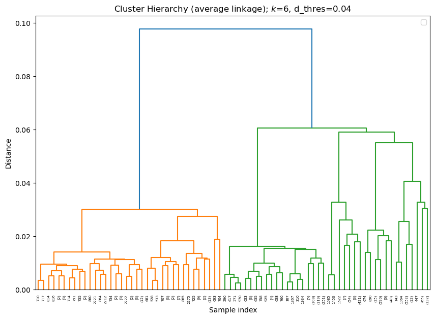
    


#### Using Single Linkage


```python
#this linkage does not even work, it just puts everything into one cluster unless distance threshold is super super small
hier_single, sil_scores_single, optimal_dt_single = tune_hier(linkage='single', dt_low=0, dt_high=1, inc=0.01)
```

    cannot compute silhouette score, determined number of clusters is too small/big. Consider increasing distance threshold


    cannot compute silhouette score, determined number of clusters is too small/big. Consider increasing distance threshold
    cannot compute silhouette score, determined number of clusters is too small/big. Consider increasing distance threshold
    cannot compute silhouette score, determined number of clusters is too small/big. Consider increasing distance threshold
    cannot compute silhouette score, determined number of clusters is too small/big. Consider increasing distance threshold
    cannot compute silhouette score, determined number of clusters is too small/big. Consider increasing distance threshold
    cannot compute silhouette score, determined number of clusters is too small/big. Consider increasing distance threshold
    cannot compute silhouette score, determined number of clusters is too small/big. Consider increasing distance threshold
    cannot compute silhouette score, determined number of clusters is too small/big. Consider increasing distance threshold
    cannot compute silhouette score, determined number of clusters is too small/big. Consider increasing distance threshold
    cannot compute silhouette score, determined number of clusters is too small/big. Consider increasing distance threshold
    cannot compute silhouette score, determined number of clusters is too small/big. Consider increasing distance threshold
    cannot compute silhouette score, determined number of clusters is too small/big. Consider increasing distance threshold
    cannot compute silhouette score, determined number of clusters is too small/big. Consider increasing distance threshold
    cannot compute silhouette score, determined number of clusters is too small/big. Consider increasing distance threshold


    cannot compute silhouette score, determined number of clusters is too small/big. Consider increasing distance threshold
    cannot compute silhouette score, determined number of clusters is too small/big. Consider increasing distance threshold
    cannot compute silhouette score, determined number of clusters is too small/big. Consider increasing distance threshold
    cannot compute silhouette score, determined number of clusters is too small/big. Consider increasing distance threshold
    cannot compute silhouette score, determined number of clusters is too small/big. Consider increasing distance threshold
    cannot compute silhouette score, determined number of clusters is too small/big. Consider increasing distance threshold
    cannot compute silhouette score, determined number of clusters is too small/big. Consider increasing distance threshold
    cannot compute silhouette score, determined number of clusters is too small/big. Consider increasing distance threshold
    cannot compute silhouette score, determined number of clusters is too small/big. Consider increasing distance threshold
    cannot compute silhouette score, determined number of clusters is too small/big. Consider increasing distance threshold
    cannot compute silhouette score, determined number of clusters is too small/big. Consider increasing distance threshold
    cannot compute silhouette score, determined number of clusters is too small/big. Consider increasing distance threshold
    cannot compute silhouette score, determined number of clusters is too small/big. Consider increasing distance threshold
    cannot compute silhouette score, determined number of clusters is too small/big. Consider increasing distance threshold


    cannot compute silhouette score, determined number of clusters is too small/big. Consider increasing distance threshold
    cannot compute silhouette score, determined number of clusters is too small/big. Consider increasing distance threshold
    cannot compute silhouette score, determined number of clusters is too small/big. Consider increasing distance threshold
    cannot compute silhouette score, determined number of clusters is too small/big. Consider increasing distance threshold
    cannot compute silhouette score, determined number of clusters is too small/big. Consider increasing distance threshold
    cannot compute silhouette score, determined number of clusters is too small/big. Consider increasing distance threshold
    cannot compute silhouette score, determined number of clusters is too small/big. Consider increasing distance threshold
    cannot compute silhouette score, determined number of clusters is too small/big. Consider increasing distance threshold
    cannot compute silhouette score, determined number of clusters is too small/big. Consider increasing distance threshold
    cannot compute silhouette score, determined number of clusters is too small/big. Consider increasing distance threshold
    cannot compute silhouette score, determined number of clusters is too small/big. Consider increasing distance threshold
    cannot compute silhouette score, determined number of clusters is too small/big. Consider increasing distance threshold
    cannot compute silhouette score, determined number of clusters is too small/big. Consider increasing distance threshold
    cannot compute silhouette score, determined number of clusters is too small/big. Consider increasing distance threshold


    cannot compute silhouette score, determined number of clusters is too small/big. Consider increasing distance threshold
    cannot compute silhouette score, determined number of clusters is too small/big. Consider increasing distance threshold
    cannot compute silhouette score, determined number of clusters is too small/big. Consider increasing distance threshold
    cannot compute silhouette score, determined number of clusters is too small/big. Consider increasing distance threshold
    cannot compute silhouette score, determined number of clusters is too small/big. Consider increasing distance threshold
    cannot compute silhouette score, determined number of clusters is too small/big. Consider increasing distance threshold
    cannot compute silhouette score, determined number of clusters is too small/big. Consider increasing distance threshold
    cannot compute silhouette score, determined number of clusters is too small/big. Consider increasing distance threshold
    cannot compute silhouette score, determined number of clusters is too small/big. Consider increasing distance threshold
    cannot compute silhouette score, determined number of clusters is too small/big. Consider increasing distance threshold
    cannot compute silhouette score, determined number of clusters is too small/big. Consider increasing distance threshold
    cannot compute silhouette score, determined number of clusters is too small/big. Consider increasing distance threshold
    cannot compute silhouette score, determined number of clusters is too small/big. Consider increasing distance threshold
    cannot compute silhouette score, determined number of clusters is too small/big. Consider increasing distance threshold


    cannot compute silhouette score, determined number of clusters is too small/big. Consider increasing distance threshold
    cannot compute silhouette score, determined number of clusters is too small/big. Consider increasing distance threshold
    cannot compute silhouette score, determined number of clusters is too small/big. Consider increasing distance threshold
    cannot compute silhouette score, determined number of clusters is too small/big. Consider increasing distance threshold
    cannot compute silhouette score, determined number of clusters is too small/big. Consider increasing distance threshold
    cannot compute silhouette score, determined number of clusters is too small/big. Consider increasing distance threshold
    cannot compute silhouette score, determined number of clusters is too small/big. Consider increasing distance threshold
    cannot compute silhouette score, determined number of clusters is too small/big. Consider increasing distance threshold
    cannot compute silhouette score, determined number of clusters is too small/big. Consider increasing distance threshold
    cannot compute silhouette score, determined number of clusters is too small/big. Consider increasing distance threshold
    cannot compute silhouette score, determined number of clusters is too small/big. Consider increasing distance threshold
    cannot compute silhouette score, determined number of clusters is too small/big. Consider increasing distance threshold
    cannot compute silhouette score, determined number of clusters is too small/big. Consider increasing distance threshold
    cannot compute silhouette score, determined number of clusters is too small/big. Consider increasing distance threshold
    cannot compute silhouette score, determined number of clusters is too small/big. Consider increasing distance threshold


    cannot compute silhouette score, determined number of clusters is too small/big. Consider increasing distance threshold
    cannot compute silhouette score, determined number of clusters is too small/big. Consider increasing distance threshold
    cannot compute silhouette score, determined number of clusters is too small/big. Consider increasing distance threshold
    cannot compute silhouette score, determined number of clusters is too small/big. Consider increasing distance threshold
    cannot compute silhouette score, determined number of clusters is too small/big. Consider increasing distance threshold
    cannot compute silhouette score, determined number of clusters is too small/big. Consider increasing distance threshold
    cannot compute silhouette score, determined number of clusters is too small/big. Consider increasing distance threshold
    cannot compute silhouette score, determined number of clusters is too small/big. Consider increasing distance threshold
    cannot compute silhouette score, determined number of clusters is too small/big. Consider increasing distance threshold
    cannot compute silhouette score, determined number of clusters is too small/big. Consider increasing distance threshold
    cannot compute silhouette score, determined number of clusters is too small/big. Consider increasing distance threshold
    cannot compute silhouette score, determined number of clusters is too small/big. Consider increasing distance threshold
    cannot compute silhouette score, determined number of clusters is too small/big. Consider increasing distance threshold
    cannot compute silhouette score, determined number of clusters is too small/big. Consider increasing distance threshold


    cannot compute silhouette score, determined number of clusters is too small/big. Consider increasing distance threshold
    cannot compute silhouette score, determined number of clusters is too small/big. Consider increasing distance threshold
    cannot compute silhouette score, determined number of clusters is too small/big. Consider increasing distance threshold
    cannot compute silhouette score, determined number of clusters is too small/big. Consider increasing distance threshold
    cannot compute silhouette score, determined number of clusters is too small/big. Consider increasing distance threshold
    cannot compute silhouette score, determined number of clusters is too small/big. Consider increasing distance threshold
    cannot compute silhouette score, determined number of clusters is too small/big. Consider increasing distance threshold
    cannot compute silhouette score, determined number of clusters is too small/big. Consider increasing distance threshold
    cannot compute silhouette score, determined number of clusters is too small/big. Consider increasing distance threshold
    cannot compute silhouette score, determined number of clusters is too small/big. Consider increasing distance threshold
    cannot compute silhouette score, determined number of clusters is too small/big. Consider increasing distance threshold
    cannot compute silhouette score, determined number of clusters is too small/big. Consider increasing distance threshold
    done


    optimal k: 2; optimal distance threshold: 0.02; silhouette score: 0.35717981385887193


```python
plt_sil_scores('single', sil_scores_single, inc=0.01, s=2)
```


    

    


```python
hier_single.n_clusters_
```


    2


```python
Z_single = linkage(X, 'single')
```


```python
plt_dendrogram(hier_single, optimal_dt_single, Z_single, 'single', p=10, truncate_mode='level', show_contracted=True)
```

    No artists with labels found to put in legend.  Note that artists whose label start with an underscore are ignored when legend() is called with no argument.


    
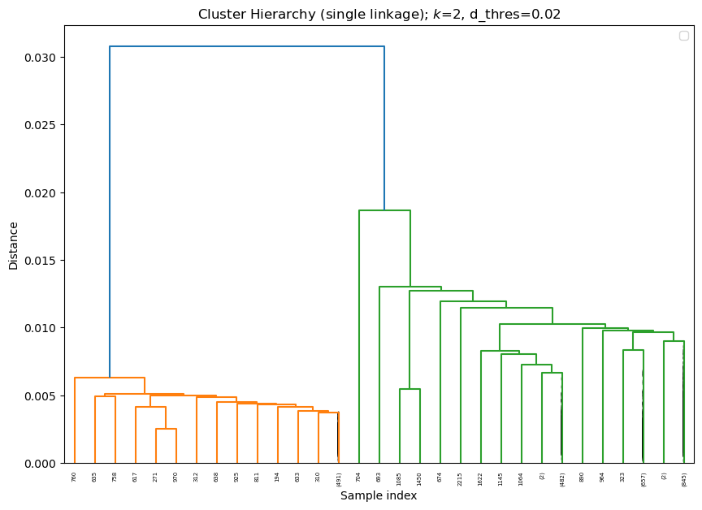
    


#### Using complete linkage


```python
#this linkage does not even work, it just puts everything into one cluster unless distance threshold is super super small
hier_complete, sil_scores_complete, optimal_dt_complete = tune_hier(linkage='complete', dt_low=0, dt_high=1, inc=0.01)
```

    cannot compute silhouette score, determined number of clusters is too small/big. Consider increasing distance threshold


    cannot compute silhouette score, determined number of clusters is too small/big. Consider increasing distance threshold
    cannot compute silhouette score, determined number of clusters is too small/big. Consider increasing distance threshold
    cannot compute silhouette score, determined number of clusters is too small/big. Consider increasing distance threshold
    cannot compute silhouette score, determined number of clusters is too small/big. Consider increasing distance threshold
    cannot compute silhouette score, determined number of clusters is too small/big. Consider increasing distance threshold


    cannot compute silhouette score, determined number of clusters is too small/big. Consider increasing distance threshold
    cannot compute silhouette score, determined number of clusters is too small/big. Consider increasing distance threshold
    cannot compute silhouette score, determined number of clusters is too small/big. Consider increasing distance threshold
    cannot compute silhouette score, determined number of clusters is too small/big. Consider increasing distance threshold
    cannot compute silhouette score, determined number of clusters is too small/big. Consider increasing distance threshold


    cannot compute silhouette score, determined number of clusters is too small/big. Consider increasing distance threshold
    cannot compute silhouette score, determined number of clusters is too small/big. Consider increasing distance threshold
    cannot compute silhouette score, determined number of clusters is too small/big. Consider increasing distance threshold
    cannot compute silhouette score, determined number of clusters is too small/big. Consider increasing distance threshold
    cannot compute silhouette score, determined number of clusters is too small/big. Consider increasing distance threshold


    cannot compute silhouette score, determined number of clusters is too small/big. Consider increasing distance threshold
    cannot compute silhouette score, determined number of clusters is too small/big. Consider increasing distance threshold
    cannot compute silhouette score, determined number of clusters is too small/big. Consider increasing distance threshold
    cannot compute silhouette score, determined number of clusters is too small/big. Consider increasing distance threshold
    cannot compute silhouette score, determined number of clusters is too small/big. Consider increasing distance threshold


    cannot compute silhouette score, determined number of clusters is too small/big. Consider increasing distance threshold
    cannot compute silhouette score, determined number of clusters is too small/big. Consider increasing distance threshold
    cannot compute silhouette score, determined number of clusters is too small/big. Consider increasing distance threshold
    cannot compute silhouette score, determined number of clusters is too small/big. Consider increasing distance threshold
    cannot compute silhouette score, determined number of clusters is too small/big. Consider increasing distance threshold


    cannot compute silhouette score, determined number of clusters is too small/big. Consider increasing distance threshold
    cannot compute silhouette score, determined number of clusters is too small/big. Consider increasing distance threshold
    cannot compute silhouette score, determined number of clusters is too small/big. Consider increasing distance threshold
    cannot compute silhouette score, determined number of clusters is too small/big. Consider increasing distance threshold
    cannot compute silhouette score, determined number of clusters is too small/big. Consider increasing distance threshold


    cannot compute silhouette score, determined number of clusters is too small/big. Consider increasing distance threshold
    cannot compute silhouette score, determined number of clusters is too small/big. Consider increasing distance threshold
    cannot compute silhouette score, determined number of clusters is too small/big. Consider increasing distance threshold
    cannot compute silhouette score, determined number of clusters is too small/big. Consider increasing distance threshold
    cannot compute silhouette score, determined number of clusters is too small/big. Consider increasing distance threshold


    cannot compute silhouette score, determined number of clusters is too small/big. Consider increasing distance threshold
    cannot compute silhouette score, determined number of clusters is too small/big. Consider increasing distance threshold
    cannot compute silhouette score, determined number of clusters is too small/big. Consider increasing distance threshold
    cannot compute silhouette score, determined number of clusters is too small/big. Consider increasing distance threshold
    cannot compute silhouette score, determined number of clusters is too small/big. Consider increasing distance threshold


    cannot compute silhouette score, determined number of clusters is too small/big. Consider increasing distance threshold
    cannot compute silhouette score, determined number of clusters is too small/big. Consider increasing distance threshold
    cannot compute silhouette score, determined number of clusters is too small/big. Consider increasing distance threshold
    cannot compute silhouette score, determined number of clusters is too small/big. Consider increasing distance threshold
    cannot compute silhouette score, determined number of clusters is too small/big. Consider increasing distance threshold


    cannot compute silhouette score, determined number of clusters is too small/big. Consider increasing distance threshold
    cannot compute silhouette score, determined number of clusters is too small/big. Consider increasing distance threshold
    cannot compute silhouette score, determined number of clusters is too small/big. Consider increasing distance threshold
    cannot compute silhouette score, determined number of clusters is too small/big. Consider increasing distance threshold
    cannot compute silhouette score, determined number of clusters is too small/big. Consider increasing distance threshold


    cannot compute silhouette score, determined number of clusters is too small/big. Consider increasing distance threshold
    cannot compute silhouette score, determined number of clusters is too small/big. Consider increasing distance threshold
    cannot compute silhouette score, determined number of clusters is too small/big. Consider increasing distance threshold
    cannot compute silhouette score, determined number of clusters is too small/big. Consider increasing distance threshold
    cannot compute silhouette score, determined number of clusters is too small/big. Consider increasing distance threshold


    cannot compute silhouette score, determined number of clusters is too small/big. Consider increasing distance threshold
    cannot compute silhouette score, determined number of clusters is too small/big. Consider increasing distance threshold
    cannot compute silhouette score, determined number of clusters is too small/big. Consider increasing distance threshold
    cannot compute silhouette score, determined number of clusters is too small/big. Consider increasing distance threshold
    cannot compute silhouette score, determined number of clusters is too small/big. Consider increasing distance threshold


    cannot compute silhouette score, determined number of clusters is too small/big. Consider increasing distance threshold
    cannot compute silhouette score, determined number of clusters is too small/big. Consider increasing distance threshold
    cannot compute silhouette score, determined number of clusters is too small/big. Consider increasing distance threshold
    cannot compute silhouette score, determined number of clusters is too small/big. Consider increasing distance threshold
    cannot compute silhouette score, determined number of clusters is too small/big. Consider increasing distance threshold


    cannot compute silhouette score, determined number of clusters is too small/big. Consider increasing distance threshold
    cannot compute silhouette score, determined number of clusters is too small/big. Consider increasing distance threshold
    cannot compute silhouette score, determined number of clusters is too small/big. Consider increasing distance threshold
    cannot compute silhouette score, determined number of clusters is too small/big. Consider increasing distance threshold
    cannot compute silhouette score, determined number of clusters is too small/big. Consider increasing distance threshold


    cannot compute silhouette score, determined number of clusters is too small/big. Consider increasing distance threshold
    cannot compute silhouette score, determined number of clusters is too small/big. Consider increasing distance threshold
    cannot compute silhouette score, determined number of clusters is too small/big. Consider increasing distance threshold
    cannot compute silhouette score, determined number of clusters is too small/big. Consider increasing distance threshold
    cannot compute silhouette score, determined number of clusters is too small/big. Consider increasing distance threshold


    cannot compute silhouette score, determined number of clusters is too small/big. Consider increasing distance threshold
    cannot compute silhouette score, determined number of clusters is too small/big. Consider increasing distance threshold
    cannot compute silhouette score, determined number of clusters is too small/big. Consider increasing distance threshold
    cannot compute silhouette score, determined number of clusters is too small/big. Consider increasing distance threshold
    cannot compute silhouette score, determined number of clusters is too small/big. Consider increasing distance threshold


    cannot compute silhouette score, determined number of clusters is too small/big. Consider increasing distance threshold
    cannot compute silhouette score, determined number of clusters is too small/big. Consider increasing distance threshold
    cannot compute silhouette score, determined number of clusters is too small/big. Consider increasing distance threshold
    cannot compute silhouette score, determined number of clusters is too small/big. Consider increasing distance threshold
    cannot compute silhouette score, determined number of clusters is too small/big. Consider increasing distance threshold


    cannot compute silhouette score, determined number of clusters is too small/big. Consider increasing distance threshold
    done
    optimal k: 7; optimal distance threshold: 0.07; silhouette score: 0.6626838369622513


```python
plt_sil_scores('complete', sil_scores_complete, inc=0.01, s=2)
```


    
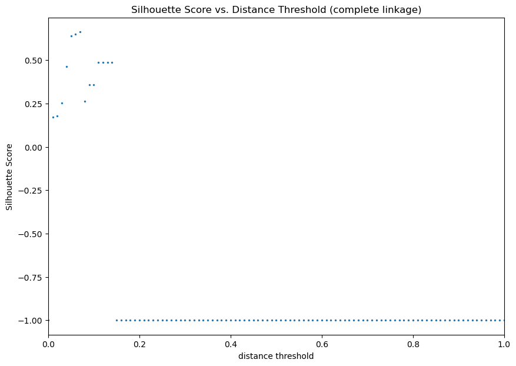
    


```python
hier_complete.n_clusters_
```


    7


```python
Z_complete = linkage(X, 'complete')
```


```python
plt_dendrogram(hier_complete, optimal_dt_complete, Z_complete, 'complete', p=6, truncate_mode='level', show_contracted=True)
```

    No artists with labels found to put in legend.  Note that artists whose label start with an underscore are ignored when legend() is called with no argument.


    
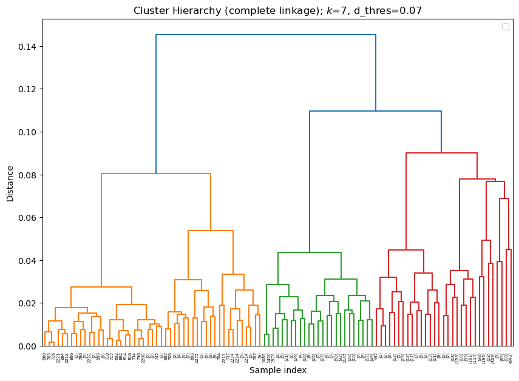
    

