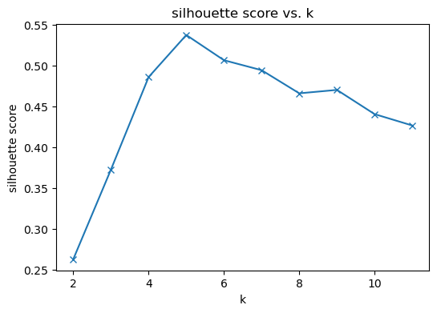
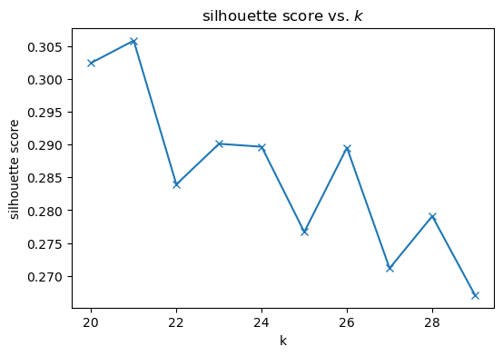
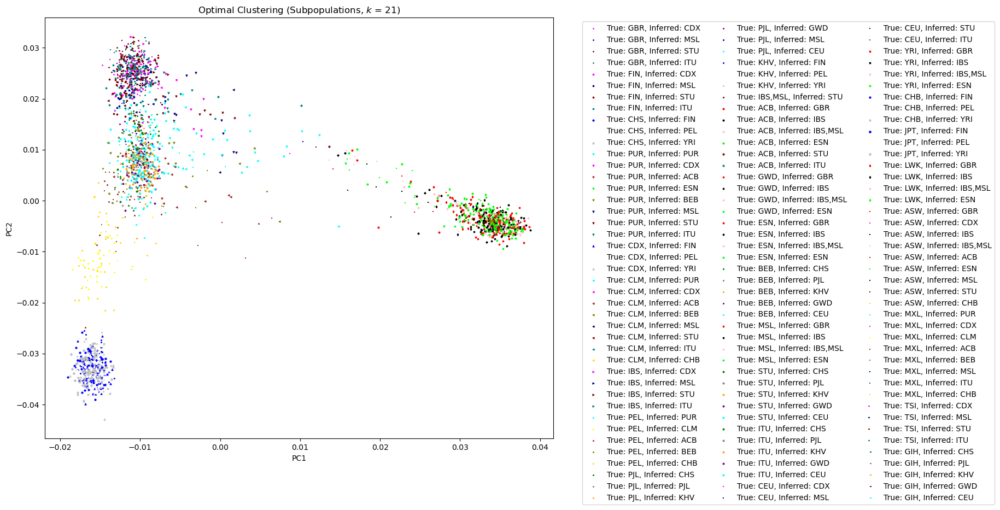

## Setup


```python
# DO NOT ALTER THIS CELL OR ITS TAG (parameters). It is used by papermill to fill in these parameters before executing the notebook.
DATA_PATH = "/home/it1123/dev_local/cse284/snp_clustering/tmp/clustering_pca.eigenvec"
K_HIGH = 14
```


```python
# Parameters
DATA_PATH = "/home/it1123/dev_local/cse284/snp_clustering/tmp/clustering_pca.eigenvec"
K_HIGH = 12

```


```python
import os
import numpy as np
import pandas as pd
from sklearn.cluster import KMeans
from sklearn.metrics import silhouette_score
from sklearn.cluster import AgglomerativeClustering
from scipy.cluster.hierarchy import dendrogram
import matplotlib.pyplot as plt

```


```python
# set directories
REPO_DIR = os.path.dirname(os.getcwd())
DATA_DIR = os.path.join(REPO_DIR, "data")
OUT_DIR = os.path.join(REPO_DIR, "out")
POPCODES_PATH = os.path.join(DATA_DIR, "igsr_samples.tsv")
RAND_SEED = 256
MARKERS = [
    ".", ",", "o", "v", "^", "<", ">", "1", "2", "3", "4", "8", "s", "p", "P", "*", "h", "H", "+", "x", "X", "D", "d", "|", "_", 
    0, 1, 2, 3, 4, 5, 6, 7, 8, 9, 10, 11
]
COLORS = [
    'red', 'blue', 'green', 'cyan', 'magenta', 'yellow', 'black', 'white',
    'gray', 'orange', 'pink', 'brown', 'purple', 'lime', 'olive', 'navy',
    'maroon', 'teal', 'aqua', 'silver', 'gold', 'indigo', 'violet', 'crimson',
    'coral', 'turquoise', 'salmon', 'khaki', 'plum', 'orchid', 'beige', 'mint',
    'lavender'
]
```

## Data Loading/Preprocessing
We assume the existence of the file containing the coordinates of each sample in the eigenbasis (computed by `plink`)

### Load data & label columns


```python
pca_data = pd.read_csv(DATA_PATH, delim_whitespace=True, header=None)
popcodes_df = pd.read_csv(POPCODES_PATH, sep="\t", header=0)
id_cols = ["family_id", "id"]
pop_cols = ["pop", "subpop"]
pc_cols = [f"pc{i+1}" for i in range(pca_data.shape[1] - 2)]
pca_data.columns =  id_cols + pc_cols
```


```python
pca_data.head()
```


<div>
<style scoped>
    .dataframe tbody tr th:only-of-type {
        vertical-align: middle;
    }

    .dataframe tbody tr th {
        vertical-align: top;
    }

    .dataframe thead th {
        text-align: right;
    }
</style>
<table border="1" class="dataframe">
  <thead>
    <tr style="text-align: right;">
      <th></th>
      <th>family_id</th>
      <th>id</th>
      <th>pc1</th>
      <th>pc2</th>
      <th>pc3</th>
      <th>pc4</th>
      <th>pc5</th>
    </tr>
  </thead>
  <tbody>
    <tr>
      <th>0</th>
      <td>HG00096</td>
      <td>HG00096</td>
      <td>-0.009763</td>
      <td>0.027213</td>
      <td>0.013751</td>
      <td>0.015727</td>
      <td>-0.032215</td>
    </tr>
    <tr>
      <th>1</th>
      <td>HG00097</td>
      <td>HG00097</td>
      <td>-0.014707</td>
      <td>0.026629</td>
      <td>0.011751</td>
      <td>0.011084</td>
      <td>-0.014454</td>
    </tr>
    <tr>
      <th>2</th>
      <td>HG00099</td>
      <td>HG00099</td>
      <td>-0.012137</td>
      <td>0.025007</td>
      <td>0.008817</td>
      <td>0.014421</td>
      <td>0.031662</td>
    </tr>
    <tr>
      <th>3</th>
      <td>HG00100</td>
      <td>HG00100</td>
      <td>-0.012606</td>
      <td>0.027683</td>
      <td>0.014390</td>
      <td>0.008601</td>
      <td>0.006966</td>
    </tr>
    <tr>
      <th>4</th>
      <td>HG00101</td>
      <td>HG00101</td>
      <td>-0.012874</td>
      <td>0.022498</td>
      <td>0.017722</td>
      <td>0.007210</td>
      <td>0.001440</td>
    </tr>
  </tbody>
</table>
</div>


```python
print (popcodes_df["Superpopulation code"].unique())
print()
print (popcodes_df['Population code'].unique())
```

    ['EUR' 'EAS' 'AMR' 'SAS' 'AFR' nan 'EUR,AFR']
    
    ['FIN' 'GBR' 'CHS' 'PUR' 'CDX' 'CLM' 'IBS' 'KHV' 'PEL' 'PJL' 'ACB' 'GWD'
     'ESN' 'BEB' 'MSL' 'ITU' 'STU' 'CEU' 'YRI' 'CHB' 'JPT' 'LWK' 'MXL' 'ASW'
     'TSI' 'GIH' 'GWJ' 'GWF' 'GWW' nan 'MKK' 'IBS,MSL']


### Map samples to population/subpopulation codes & get feature matrix $X$


```python
#map samples to populations/subpopulation code
pca_data["pop"] = pca_data["id"].apply(lambda x: popcodes_df.loc[popcodes_df['Sample name'] == x, 'Superpopulation code'].squeeze())
pca_data["subpop"] = pca_data["id"].apply(lambda x: popcodes_df.loc[popcodes_df['Sample name'] == x, 'Population code'].squeeze())

pca_data = pca_data.loc[:, id_cols + pop_cols + pc_cols]
#get feature matrix for clustering
pop_data = pca_data.loc[:, id_cols + pop_cols]
X = pca_data.loc[:, pc_cols].to_numpy()

```


```python
pop_data.head()
```


<div>
<style scoped>
    .dataframe tbody tr th:only-of-type {
        vertical-align: middle;
    }

    .dataframe tbody tr th {
        vertical-align: top;
    }

    .dataframe thead th {
        text-align: right;
    }
</style>
<table border="1" class="dataframe">
  <thead>
    <tr style="text-align: right;">
      <th></th>
      <th>family_id</th>
      <th>id</th>
      <th>pop</th>
      <th>subpop</th>
    </tr>
  </thead>
  <tbody>
    <tr>
      <th>0</th>
      <td>HG00096</td>
      <td>HG00096</td>
      <td>EUR</td>
      <td>GBR</td>
    </tr>
    <tr>
      <th>1</th>
      <td>HG00097</td>
      <td>HG00097</td>
      <td>EUR</td>
      <td>GBR</td>
    </tr>
    <tr>
      <th>2</th>
      <td>HG00099</td>
      <td>HG00099</td>
      <td>EUR</td>
      <td>GBR</td>
    </tr>
    <tr>
      <th>3</th>
      <td>HG00100</td>
      <td>HG00100</td>
      <td>EUR</td>
      <td>GBR</td>
    </tr>
    <tr>
      <th>4</th>
      <td>HG00101</td>
      <td>HG00101</td>
      <td>EUR</td>
      <td>GBR</td>
    </tr>
  </tbody>
</table>
</div>


```python
X[:5]
```


    array([[-0.0097632 ,  0.0272129 ,  0.013751  ,  0.0157271 , -0.0322151 ],
           [-0.0147066 ,  0.0266289 ,  0.0117507 ,  0.0110837 , -0.014454  ],
           [-0.0121369 ,  0.0250071 ,  0.00881677,  0.0144206 ,  0.0316624 ],
           [-0.0126055 ,  0.0276831 ,  0.0143899 ,  0.00860087,  0.00696581],
           [-0.0128736 ,  0.0224982 ,  0.0177218 ,  0.00721044,  0.00144017]])


### create mapping between true population and point shape in clustering


```python
pops_unique = pca_data['pop'].unique()
pop_shapes = dict(zip(pops_unique, MARKERS[:pops_unique.shape[0]]))
```


```python
subpops_unique = pca_data['subpop'].unique()
subpop_shapes = dict(zip(subpops_unique, MARKERS[:subpops_unique.shape[0]]))
subpop_shapes
```


    {'GBR': '.',
     'FIN': ',',
     'CHS': 'o',
     'PUR': 'v',
     'CDX': '^',
     'CLM': '<',
     'IBS': '>',
     'PEL': '1',
     'PJL': '2',
     'KHV': '3',
     'IBS,MSL': '4',
     'ACB': '8',
     'GWD': 's',
     'ESN': 'p',
     'BEB': 'P',
     'MSL': '*',
     'STU': 'h',
     'ITU': 'H',
     'CEU': '+',
     'YRI': 'x',
     'CHB': 'X',
     'JPT': 'D',
     'LWK': 'd',
     'ASW': '|',
     'MXL': '_',
     'TSI': 0,
     'GIH': 1}


## Clustering
#### Here we cluster the principal component data using $k$-means clustering and hierarchical clustering (Ward's method, agglomerative).

### $k$-Means Clustering

#### Find optimal $k$


```python
# fit K-means, tune k
#silhouette scores as a measure of clustering quality
#sil scores are from -1 to 1
sil_scores = []
K = range(2, K_HIGH)
for k in K:
    kmeans = KMeans(n_clusters=k, init='k-means++', n_init=10, max_iter=300, random_state=RAND_SEED)
    kmeans.fit(X)
    labels = kmeans.labels_
    sil_scores.append(silhouette_score(X, labels))

sil_scores = np.array(sil_scores)
optimal_k = K[np.argmax(sil_scores)]
kmeans_optimal = KMeans(n_clusters=optimal_k, init='k-means++', n_init=10, max_iter=300, random_state=RAND_SEED)
kmeans_optimal.fit(X)
print (f"optimal k: {optimal_k}; best silhouette score: {np.max(sil_scores)}")
```

    optimal k: 5; best silhouette score: 0.5371749864259305


#### Plot silhouette score vs $k$


```python
# plot clustering quality vs k
plt.figure(figsize=(6, 4))
plt.plot(K, sil_scores, marker='x')
plt.xlabel('k')
plt.ylabel('silhouette score')
plt.title('silhouette score vs. k')
plt.show()
```


    

    


#### Plot optimal clustering


```python
pca_data['inferred_assignment'] = kmeans_optimal.labels_
plt.figure(figsize=(11, 11))
plt.title(f'Optimal Clustering (Populations, $k$ = {optimal_k})')
plt.xlabel("PC1")
plt.ylabel("PC2")
for true_pop in pops_unique:
    for inferred_assignment in range(kmeans_optimal.labels_.max() + 1):
        # Select points that have true population = true_pop and inferred pop = inferred assignment
        mask = (pca_data['pop'] == true_pop) & (pca_data['inferred_assignment'] == inferred_assignment)

        #X has the same ordering as pca_data
        #we are naively selecting the first two coordinates because the first two PCs likely will dominate the coordinate variance
        selected_points = X[mask, :]
        
        # Plot selected points with the corresponding marker and color
        plt.scatter(selected_points[:, 0], selected_points[:, 1], s=12, marker=pop_shapes[true_pop], color=COLORS[inferred_assignment], label=f"True: {true_pop}, Inferred: {pops_unique[inferred_assignment]}")
plt.legend(bbox_to_anchor=(1.06, 1), loc='upper left', ncol=2)

```


    <matplotlib.legend.Legend at 0x7f2d08764670>


    

    


### Does optimal $k$-means clustering capture subpopulation structure?


```python
sil_scores_subpop = []
K = range(20, 30)
for k in K:
    kmeans = KMeans(n_clusters=k, init='k-means++', n_init=10, max_iter=300, random_state=RAND_SEED)
    kmeans.fit(X)
    labels = kmeans.labels_
    sil_scores_subpop.append(silhouette_score(X, labels))

sil_scores_subpop = np.array(sil_scores_subpop)
optimal_k_subpop = K[np.argmax(sil_scores_subpop)]
kmeans_optimal_subpop = KMeans(n_clusters=optimal_k_subpop, init='k-means++', n_init=10, max_iter=300, random_state=RAND_SEED)
kmeans_optimal_subpop.fit(X)
print (f"optimal k: {optimal_k_subpop}; best silhouette score: {np.max(sil_scores_subpop)}")
```

    optimal k: 21; best silhouette score: 0.30585522497446194


```python
# plot clustering quality vs k
plt.figure(figsize=(6, 4))
plt.plot(K, sil_scores_subpop, marker='x')
plt.xlabel('k')
plt.ylabel('silhouette score')
plt.title('silhouette score vs. $k$')
plt.show()
```


    

    


```python

pca_data['inferred_assignment'] = kmeans_optimal_subpop.labels_
plt.figure(figsize=(12, 10))
plt.title(f'Optimal Clustering (Subpopulations, $k$ = {optimal_k_subpop})')
plt.xlabel("PC1")
plt.ylabel("PC2")
for true_subpop in subpops_unique:
    for inferred_assignment in range(kmeans_optimal_subpop.labels_.max() + 1):
        # Select points that have true population = true_pop and inferred pop = inferred assignment
        mask = (pca_data['subpop'] == true_subpop) & (pca_data['inferred_assignment'] == inferred_assignment)

        #X has the same ordering as pca_data
        #we are naively selecting the first two coordinates because the first two PCs likely will dominate the variation
        selected_points = X[mask, :]
        if selected_points.shape[0] == 0: continue
        # plot selected pts with the corresponding marker and color
        plt.scatter(selected_points[:, 0], selected_points[:, 1], s=4, marker=subpop_shapes[true_subpop], color=COLORS[inferred_assignment], label=f"True: {true_subpop}, Inferred: {subpops_unique[inferred_assignment]}")
plt.legend(bbox_to_anchor=(1.05, 1), loc='upper left', ncol=3)
```


    <matplotlib.legend.Legend at 0x7f2c9cdef940>


    

    


##### Analysis


```python
#what's the number of true subpopulations in our data?
num_pops = pca_data['pop'].unique().shape[0]
num_subpops = pca_data['subpop'].unique().shape[0]
num_pops, num_subpops
```


    (6, 27)


We can see here that the silhouette score is highest when the number of clusters is equal to the true number of populations in the data. The silhouette score drops considerably when tuning to a number of clusters near the true number of subpopulations. This likely indicates that traditional $k$-means is not precise enough for clustering at subpopulation-level granularity.

### Hierarchical Clustering (TODO)


```python
#for plotting hierarchy.
#see https://scikit-learn.org/stable/auto_examples/cluster/plot_agglomerative_dendrogram.html
def plot_dendrogram(model, **kwargs):
    # Create linkage matrix and then plot the dendrogram

    # create the counts of samples under each node
    counts = np.zeros(model.children_.shape[0])
    n_samples = len(model.labels_)
    for i, merge in enumerate(model.children_):
        current_count = 0
        for child_idx in merge:
            if child_idx < n_samples:
                current_count += 1  # leaf node
            else:
                current_count += counts[child_idx - n_samples]
        counts[i] = current_count

    linkage_matrix = np.column_stack(
        [model.children_, model.distances_, counts]
    ).astype(float)
```
